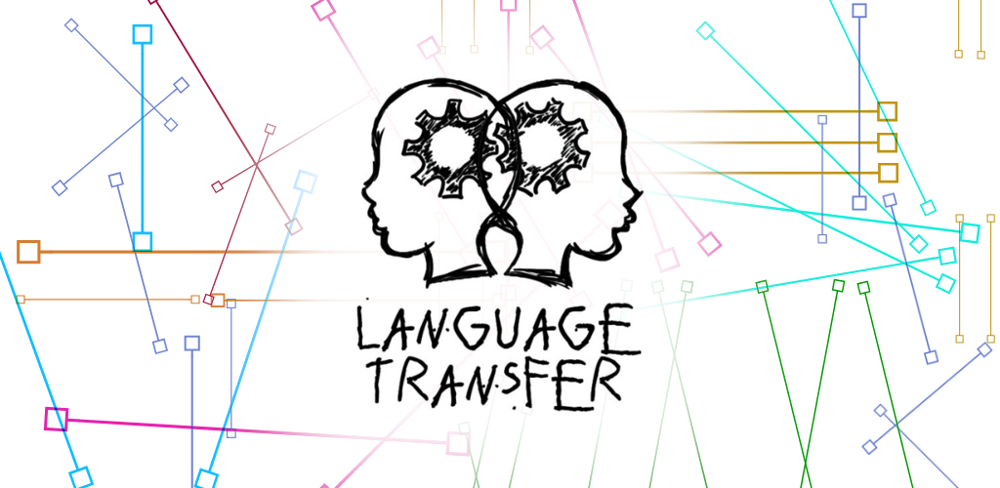

  

## Language Transfer

Jen Nia Mondo is an introductory series of lessons in Esperanto — the living language which aims to solve the world's language problem by becoming a second language, neutral and simple, for all
mankind.

First published by the [Esperanto Association of Britain](https://www.esperanto.org.uk) over 50 years ago, and used and enjoyed since then by countless students in an audio format with accompanying booklets, the course is now available as a fully featured app. This allows you to participate fully, wherever you are in the world. Just engage, pause, think and answer out loud, and the rest will take care of itself.

## JNM App

This app is a fork of the [Language Transfer](https://www.languagetransfer.org/) app platform. Language Transfer is a project by Mihalis Eleftheriou, building audio courses for learning languages, completely free.

This app is developed in React Native, and is designed to work with both iOS & Android platforms.

## Licensing

The code for the Jen Nia Mondo app is provided under the [GPLv2 license](./LICENSE).